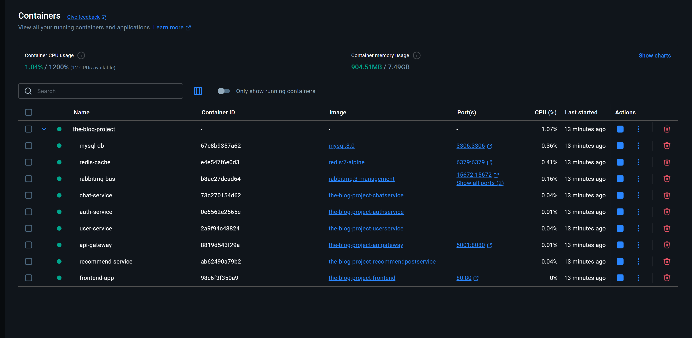

# Hướng dẫn Setup và Chạy Dự án Dev/Test (The Blog Project)

Tài liệu này hướng dẫn bạn cách thiết lập môi trường và chạy toàn bộ hệ thống microservices.

## 1. Yêu cầu Hệ thống (Prerequisites)

- **Docker Desktop**: để chạy các container nhanh chóng, đã được cấu hình sẵn image trong file script
- **Postman**: Để test API.

## 2. Lệnh khởi chạy duy nhất
> Dùng Windows PowerShell để chạy version dev/test
```bash
.\script-build-all-and-run.ps1
```

## 3. Địa chỉ truy cập (Có thể check trong Docker log)
- **Frontend**: [http://localhost:3000](http://localhost:3000)
- **API Gateway**: `https://localhost:5001` (Toàn bộ request từ Frontend sẽ đi qua đây)


